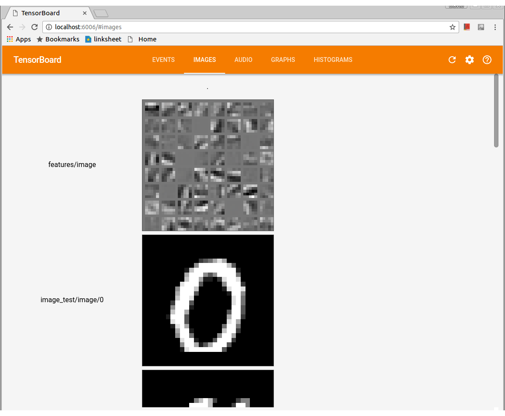

# Convolutional Neural Networks
This project trains and evaluates convolutional neural networks with tensorflow.
Images (ong or jpeg) will be loaded from your local file system. To create your
own training / evaluation set, datr (https://github.com/peerdavid/datr) can be used.
Simply download images and put them into folders named 0, 1, ... for all different classes
and set the folder in the params.py (FLAGS.img_dir) file. To train and predict cnn's you can 
use the following components:


## params.py
This file contains all flags which can be set such as learning_rate, img_dir, test_size etc.


## data_input.py
Is responsible for loading training, testing, evaluation and images for predictions.
Training, testing and evaluation data must be structured into the following folders:<br>
```
img_dir
   |--0
   |  |-###.jpg
   |  |-###.jpg
   |
   |--1
   |  |-###.jpg
```

The name of the folder is the label used for the training.


## train.py
Call python3 train.py to train your cnn (which is defined in model.py). 
With the FLAGS.optimizer flag you can define your favorite optimizer.
After 10 steps, a console log will output the current loss value, after 100 steps
general values for tensorboard are written into the log_dir. After 1000 steps 
the training and testing (testing data will only be used for evaluation during training) accuracy
will be calculated and written into tensorboard. After 2000 steps a checkpoint file will be written
into the log_dir. This files will be used by evaluation.py and predict.py
<br><br>
To see the accuracy, conv1 kernel, histograms, loss etc. during the training, start tensorboard and
open http://localhost:6006/ in your browser.
```
tensorboard --logdir path/to/log_dir
```

## model.py
This file contains the architecture for your convolutional neural network.
The example contains the following architecture:
INPUT -> [CONV -> POOL -> NORM]*2 -> FC -> FC -> SOFTMAX

The kernel of the conv1 layer will also be displayed in tensorboard:



## evaluation.py
To evaluate different network architectures after the training, you can use evaluation.py
Set the eval_dir and call python3 evaluation.py (Note: The structure of the directory must be the same as the img_dir).
The images used in eval_dir should not be contained in your training data. evaluation.py will calculate the accuracy
and the confusion matrix. Example: <br>
```
Restore session from checkpoint log/model.ckpt-4001                                                                  
                                                                                                                                
Running evaluation for data/                                                                                              
                                                                                                                                
Num examples: 60000  Num correct: 59523  Precision @ 1: 0.9920                                                                  
                                                                                                                                
[[5869    0    0    1    1    1    4    1    1    3]                                                                            
 [   5 6720    2    1   11    0    1   35    6    5]                                                                            
 [   7    5 5932   10    4    0    1   15    7    3]                                                                            
 [   2    1    6 6093    0   37    0   11    1    5]                                                                            
 [   0    4    1    0 5794    0    1   13    3   11]                                                                            
 [   1    2    0    3    0 5344    7    0    1    4]                                                                            
 [  18    1    0    0    7   11 5897    0    5    0]                                                                            
 [   0    5    7    3    3    0    0 6157    0   10]                                                                            
 [  17    4    7   17    3   25    7    8 5824   15]                                                                            
 [   3    0    3    3   20    3    0   25    3 5893]]                                                                           
                                                                                                                                
Waiting for all threads...               

Done.
```

## predict.py
If you want to predict images from your trained model, set the FLAGS.checkpoint in params.py
and all images you want to predict inside the predict.py file. The output will be the predicted
class of your (already trained) network.